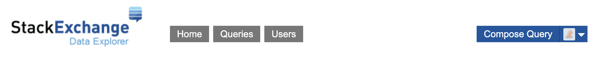

# Le-Data-2.0-DATA
This repository contains the data for the [Le Data 2.0 (Trends in the Programming World)](https://github.com/aggarwalc/le-data-2.0) project.

## Contributing
If you would like to update the data, follow the instructions below.

### Stack Overflow
The Stack Overflow data was gathered using the [Stack Exchange Data Explorer](https://data.stackexchange.com/).
To compose a new query navigate to the compose query button as seen below.

<br> For each folder inside the Stack-Overflow folder...
1. Copy the contents of the SQL file and paste it into your new query
2. Replace the CSV file in the folder with the new CSV file that the query returns
3. Make sure the name of the new CSV file is the same as the old one!

### GitHub
The GitHub data was gathered by web scraping.
For each folder inside the GitHub folder...
1. Open the python file (gh_top_monthly.py for gh-top)
2. Go to line 44 and make sure the for loop includes the current year
```python
for year in range(2008,2023):
```
3. Go to line 51 and change the date to the current year and month
```python
if date == '2022-06': break
```
4. Run the program and replace the CSV file in the folder with the new CSV file that the web scraping program returns
5. Make sure the name of the new CSV file is the same as the old one!
6. (Extra Step for gh-top) Run gh-top-yearly.py

### LinkedIn
The LinkedIn data was gathered by web scraping as well.
To update the data, simply run the python program located in the LinkedIn program. If you run into an index error, run the program again until the program executes without an issue. I will be searching for a fix to this problem.
